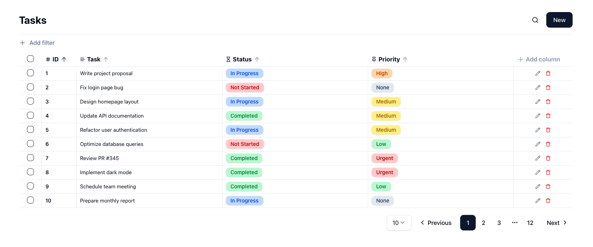
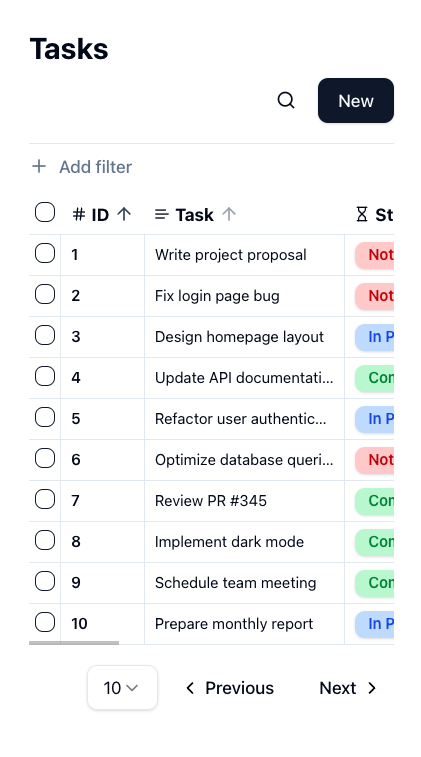

<h1>Task Management App</h1>

<p align="center">
  <a href="https://nodejs.org/en/" target="_blank">
    
  </a>
  <a href="https://www.npmjs.com/" target="_blank">
    
  </a>
  <a href="https://nextjs.org/" target="_blank">
    
  </a>
  <a href="https://react.dev/" target="_blank">
    
  </a>
  <a href="https://www.linkedin.com/in/dominguetigs/" target="_blank">
    
  </a>
</p>

<p align="center">
  <a href="#about">About</a>&nbsp;&nbsp;&nbsp;|&nbsp;&nbsp;&nbsp;
  <a href="#main-features">Main features</a>&nbsp;&nbsp;&nbsp;|&nbsp;&nbsp;&nbsp;
  <a href="#bonus-features">Bonus features</a>&nbsp;&nbsp;&nbsp;|&nbsp;&nbsp;&nbsp;
  <a href="#technologies">Technologies</a>&nbsp;&nbsp;&nbsp;|&nbsp;&nbsp;&nbsp;
  <a href="#best-practices-and-tooling">Best Practices & Tooling</a>&nbsp;&nbsp;&nbsp;|&nbsp;&nbsp;&nbsp;
  <a href="#project-structure">Project structure</a>&nbsp;&nbsp;&nbsp;|&nbsp;&nbsp;&nbsp;
  <a href="#how-to-use">How to use</a>&nbsp;&nbsp;&nbsp;|&nbsp;&nbsp;&nbsp;
</p>

<h3 align="center">
  <a
    href="https://task-management-app-gt62.vercel.app/"
    target="_blank"
  >Access the demo</a>
</h3>

<a id="about"></a>

## :bookmark: About

This project is a Task Management App built with Next.js, React, TypeScript, and Zustand. It allows users to create, edit, categorize, and track tasks efficiently. The app was designed with a custom-built table view, dynamic filtering, and inline editing, providing a seamless user experience.

<a id="main-features"></a>

## :dart: Main features

- _Task creation and editing_ with title, status, and priority selection.
- _Inline editing_ available for all table columns except the ID column, allowing quick modifications directly in the table.
- _Task deletion_ available both from the table row and within the task edit form.
- _Custom-built table view_ for task visualization, designed from scratch for flexibility and performance.
- _Custom pagination_ with options to define items per page and a clear indication of the currently selected page.
- _Sorting configuration_ available for all table columns, allowing dynamic ordering of tasks.
- _Custom fields support_ with text, number, and boolean types, enabling flexible task attributes.
- _Column-based filtering_ with intelligent filtering based on column types, including default filters for title (task name), priority, and status.
- _Custom field filtering_ automatically adapts to the field type (text, number, or boolean).

<a id="bonus-features"></a>

## :sparkles: Bonus features

- _Micro-animations_ to enhance user experience, providing smooth transitions and feedback for actions like task updates, filtering, and pagination.
- _Multi-select support_ in the table, allowing bulk actions such as mass deletion, bulk status updates, and priority changes.
- _Undo/Redo functionality_ available for certain task creation, editing, and deletion actions.
- _Global search_ field to quickly find tasks across the entire table.

<a id="technologies"></a>

## :rocket: Technologies and libraries

The project was developed using the following technologies and libraries:

- [NextJS](https://nextjs.org/)
- [ReactJS](https://react.dev/)
- [ShadcnUI](https://ui.shadcn.com/)
- [Zustand](https://zustand-demo.pmnd.rs/)
- [TypeScript](https://www.typescriptlang.org/)

<a id="best-practices-and-tooling"></a>

## :white_check_mark: Best Practices & Tooling

This project follows modern best practices to ensure code quality, consistency, and maintainability:

- [Husky](https://typicode.github.io/husky/get-started.html) Automates pre-commit hooks to enforce standards before pushing changes.
- [ESLint](https://eslint.org/) Ensures consistent code quality by identifying and fixing linting issues.
- [Prettier](https://prettier.io/) Automatically formats code to maintain a uniform style.
- [Commitlint](https://commitlint.js.org/) Enforces a standardized commit message format.
- [Lint-staged](https://github.com/lint-staged/lint-staged) Runs linters on staged files before committing, ensuring only formatted and checked code is pushed.

<a id="project-structure"></a>

## :open_file_folder: Project structure

```
/task-management-app
│── src/                     # Main source code
│   ├── app/                 # Next.js app directory (includes pages, layouts, and API routes)
│   ├── components/          # Reusable UI components (ShadCN UI components and custom ones)
│   ├── constants/           # Static values and configuration constants
│   ├── containers/          # High-level components that structure sections of the app
│   ├── lib/                 # Shared libraries, helpers, and integrations
│   ├── services/            # Handles data persistence and business logic (using LocalStorage for storage)
│   ├── stores/              # State management (Zustand)
│   ├── types/               # TypeScript types and interfaces
│   ├── utils/               # Utility functions and helper methods
│── public/                  # Static assets (images, fonts, favicons)
│── package.json             # Project dependencies and scripts
│── README.md                # Project documentation
```

## :heavy_check_mark: :computer: Desktop Result

<h1 align="center">
    
</h1>

## :heavy_check_mark: :iphone: Mobile Result

<h1 align="center">
    
</h1>

<a id="how-to-use"></a>

## :fire: How to use

- ### **Prerequisites**

  - It is **necessary** to have **[Node.js](https://nodejs.org/en/)** installed on the machine in the lts version.
  - Also, you **need** to have a package manager be it **[NPM](https://www.npmjs.com/)** or **[Yarn](https://yarnpkg.com/)**.

1. Clone the repository:

```sh
  $ git clone git@github.com:dominguetigs/task-management-app.git
```

2. Run the Application:

```sh
  # Install the dependencies
  $ npm install

  # Initialize the application
  $ npm run dev
```

## :memo: License

This project is under the MIT license. See the [LICENSE](LICENSE.md) file for more details.

---

<h4 align="center">
    Done with 💙 by <a
      href="https://www.linkedin.com/in/dominguetigs/"
      target="_blank"
    >Gustavo Domingueti</a>
</h4>
